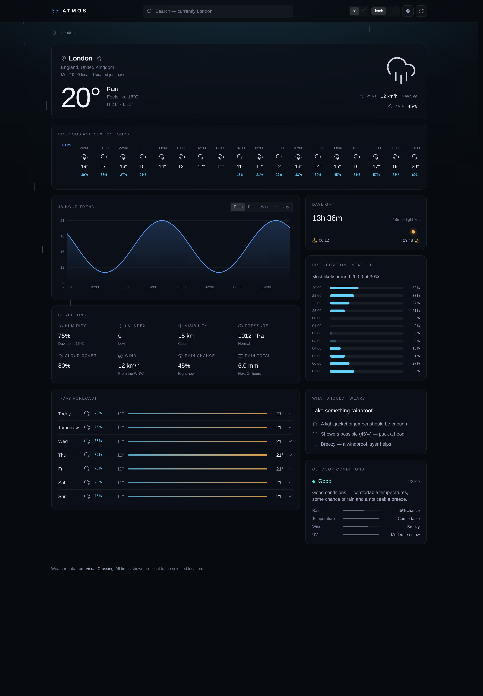
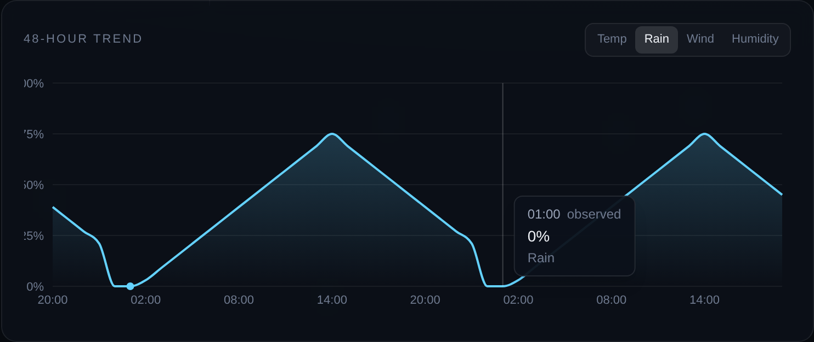
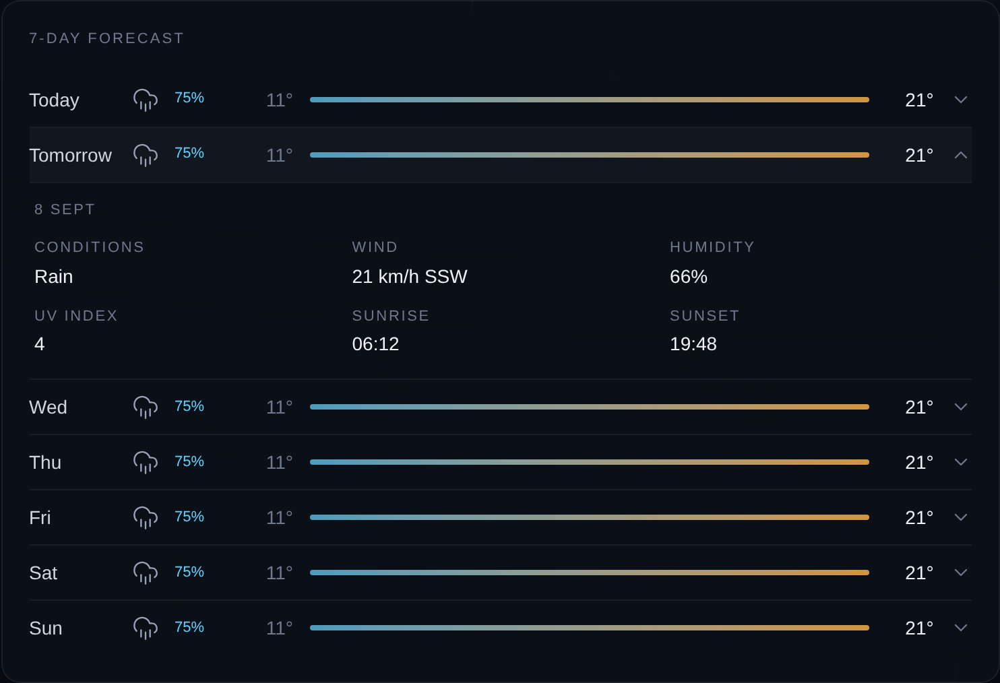
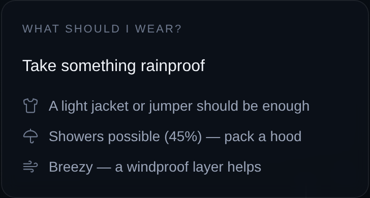
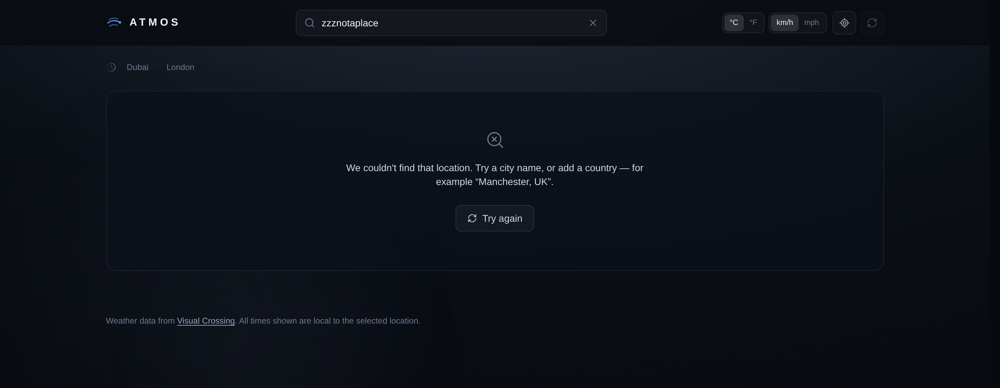
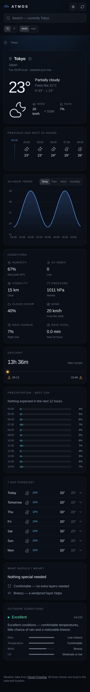
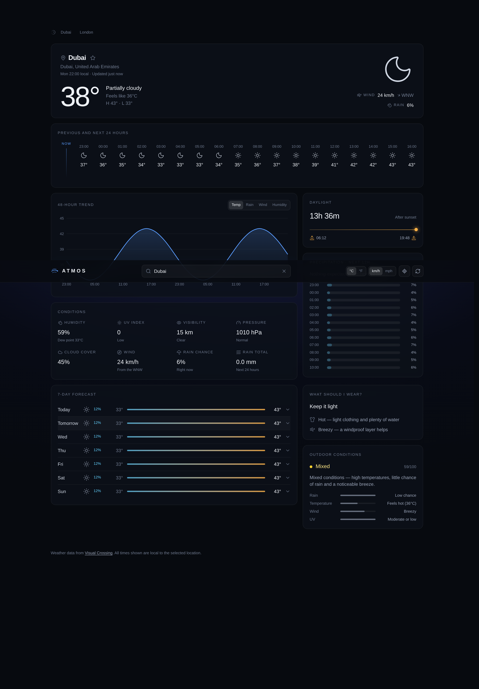
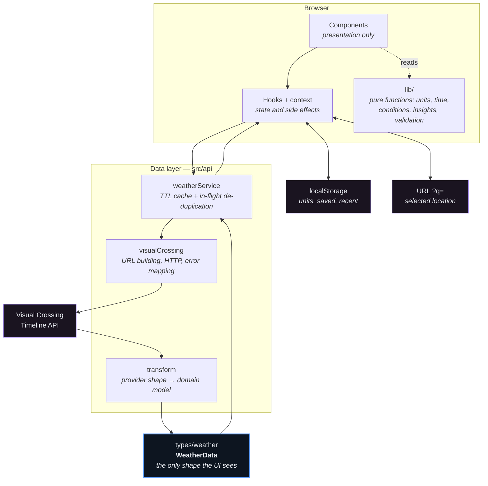
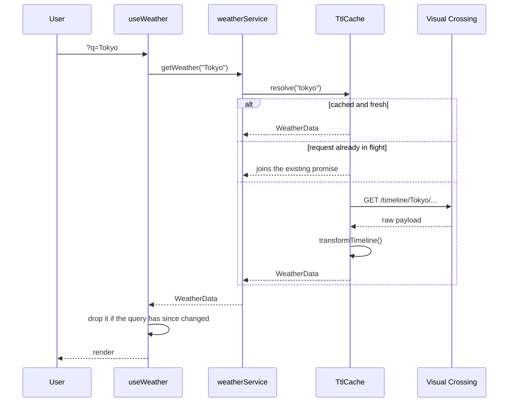

<div align="center">

# Atmos

**Weather for anywhere, always in the local time of the place you looked up.**

[](https://github.com/Advaith-Ganesh/Atmos-Weather-App/actions/workflows/ci.yml)
[](LICENSE)


</div>

---

## Overview

Most weather apps quietly render forecast times in *your* timezone. Search Tokyo from London and
you get Tokyo's weather against London's clock — sunrise at 22:00, an "overnight" low in the middle
of the afternoon. It's a small bug that makes the data useless for the thing people actually use a
forecast for: deciding when to do something.

Atmos fixes that. Every timestamp — hourly columns, the chart axis, sunrise, sunset, the day
boundaries the 7-day forecast is sliced on — is rendered through the searched location's own IANA
timezone, with DST handled by `Intl` rather than offset arithmetic.

It was built as a portfolio project to work through a set of problems that are genuinely fiddly:
timezone-correct rendering, normalising an inconsistent third-party API into a stable domain model,
a request cache that de-duplicates concurrent callers, and an interface that stays accessible while
still looking like a real product.

---

## Screenshots

<div align="center">

</div>

<table>
<tr>
<td width="50%"></td>
<td width="50%"></td>
</tr>
<tr>
<td></td>
<td></td>
</tr>
</table>

<details>
<summary><b>Mobile layout and clear-weather backdrop</b></summary>
<br>
<table>
<tr>
<td width="34%"></td>
<td width="66%"></td>
</tr>
</table>
</details>

> Captured in development against a local stub that returns Visual Crossing-shaped payloads — the
> interface and behaviour are real, the weather values are generated. See
> [`assets/screenshots/README.md`](assets/screenshots/README.md).

---

## Key features

| | |
| --- | --- |
| **Timezone-correct throughout** | Hours, chart, sun times and day boundaries all use the searched location's IANA zone. DST transitions and date rollover are covered by tests. |
| **48-hour timeline** | The previous 24 hours of observations and the next 24 of forecast in one scrollable strip, opening on the current hour. |
| **Interactive chart** | Temperature, rain probability, wind or humidity, with tooltips, a current-hour marker, and a hidden data table so it is readable by screen reader. |
| **7-day forecast** | Temperature-range bars; expand a day for wind, humidity, UV and sun times. |
| **Precipitation outlook** | The next twelve hours as labelled meters, with the peak hour called out. |
| **Daylight track** | Sunrise, sunset, total daylight, and where the current moment sits between them. |
| **Deterministic insights** | "What should I wear?" and "Outdoor conditions" are plain threshold rules over the forecast — no model, no extra request. |
| **Saved locations & recent searches** | Kept in `localStorage`, validated on read. |
| **Shareable URLs** | The location lives in `?q=`, so a link opens on the same place. |
| **Unit switching** | °C/°F and km/h/mph, converted properly and remembered. |
| **Offline aware** | Fails fast without spending a request, and reloads by itself once you reconnect. |
| **Accessible** | Semantic landmarks, keyboard operable throughout, `prefers-reduced-motion` respected, text alternatives for every visual-only element. |
| **No third-party runtime requests** | No font CDN, no analytics, no trackers. |

---

## Architecture

The provider's response shape stops at one file. Nothing above `src/api` knows Visual Crossing
exists — components read a normalised domain model, so swapping providers means rewriting the
client and the transformer, and nothing else.



### Request flow

Every entry point — typing a search, clicking a saved location, a geolocation fix, or loading a
shared link — ends in the same place: the query string in the URL.



Full notes, including the trust boundaries and the failure-handling layers, are in
**[`docs/architecture.md`](docs/architecture.md)**.

---

## Technology stack

| Layer | Choice | Why |
| --- | --- | --- |
| UI | **React 19** + **TypeScript** | Typed domain model end to end; no `any` in `src/` |
| Build | **Vite 8** | Fast dev server, straightforward production build |
| Styling | **Tailwind CSS v4** | Design tokens declared in `@theme`; no separate config file |
| Charts | **Recharts** | Lazy-loaded — it is the heaviest dependency and nothing above the fold needs it |
| Icons | **Lucide React** | Tree-shakeable, consistent stroke weight |
| Tests | **Vitest** + **Testing Library** | 323 tests across pure logic, hooks and components |
| Lint | **oxlint** | Fast; warnings fail the build, same as CI |
| Data | **Visual Crossing Timeline API** | One request returns history, current conditions and forecast together |

Six runtime dependencies. An animation library was removed during development once it turned out to
cost ~41 kB gzipped for a single accordion — see [Technical decisions](#technical-decisions).

---

## Getting started

**Prerequisites:** Node.js 20 or newer.

```bash
git clone https://github.com/Advaith-Ganesh/Atmos-Weather-App.git
cd Atmos-Weather-App
npm install
cp .env.example .env      # then paste your API key into it
npm run dev
```

The dev server prints a local URL, usually <http://localhost:5173>.

### Getting an API key

1. Sign up at [visualcrossing.com](https://www.visualcrossing.com/sign-up). The free tier allows
   1,000 records per day, which is ample for local use.
2. Copy the key from your account page.
3. Paste it into `.env` as `VITE_VISUAL_CROSSING_API_KEY=...`.
4. Restart the dev server — Vite only reads `.env` at startup.

### Scripts

| Command | Purpose |
| --- | --- |
| `npm run dev` | Start the dev server |
| `npm run build` | Type-check, then build for production |
| `npm run preview` | Serve the production build locally |
| `npm test` | Run the test suite once |
| `npm run test:watch` | Run tests in watch mode |
| `npm run test:coverage` | Run tests with a coverage report |
| `npm run lint` | Lint — warnings fail, same as CI |
| `npm run typecheck` | Type-check without building |

---

## Configuration

| Variable | Required | Purpose |
| --- | --- | --- |
| `VITE_VISUAL_CROSSING_API_KEY` | Yes | Visual Crossing Timeline API key |
| `VITE_VISUAL_CROSSING_BASE_URL` | No | Override the API base URL — for pointing at a proxy, or a stub during development |

`.env` is gitignored. [`.env.example`](.env.example) shows the expected shape and contains no real
values.

> **The API key is not a secret.** Vite inlines every `VITE_*` variable into the JavaScript bundle
> at build time, so anyone can read it from a deployed copy. This is a deliberate trade-off for a
> client-only app. If you deploy publicly and care about the quota, put a small proxy in front of
> the API, keep the key server-side, and point `VITE_VISUAL_CROSSING_BASE_URL` at the proxy.

---

## How it works

<details>
<summary><b>Why the date range is requested in UTC with a day of slack</b></summary>
<br>

The client asks for `yesterday → +7 days` in UTC. A location's own calendar day can sit up to
fourteen hours from UTC, so the extra day at each end guarantees that — after the series is re-sliced
in the location's timezone — there are always a full 24 hours of history and seven complete forecast
days, wherever you searched.

</details>

<details>
<summary><b>Why there is no <code>AbortController</code></b></summary>
<br>

The cache can hand the same in-flight promise to several callers. If any one of them aborted, it
would break the others. Instead each request is tagged with a monotonic id and responses from a
superseded request are discarded on arrival — the same user-visible outcome, without the
shared-state hazard.

</details>

<details>
<summary><b>How the insights are computed</b></summary>
<br>

"What should I wear?" and "Outdoor conditions" are plain threshold rules over the current conditions
and the next six hours, in [`src/lib/insights.ts`](src/lib/insights.ts). Outdoor conditions starts at
100 and subtracts capped penalties for rain probability, distance outside a 12–26 °C comfort band,
wind above 15 km/h and UV above 6. No model is involved and no extra request is made; the rules are
pure functions and are tested directly.

</details>

<details>
<summary><b>How the forecast accordion animates without JavaScript</b></summary>
<br>

Animating `grid-template-rows` between `0fr` and `1fr` expands a row to its content's natural height
with no measurement and no library. The collapsed panel stays mounted so the transition has
something to animate, and carries `inert` so it is skipped by the tab order and the accessibility
tree while hidden.

</details>

---

## Project structure

```
src/
├── api/                  Provider boundary — nothing above this knows about Visual Crossing
│   ├── visualCrossing.ts     URL building, HTTP, status → error mapping
│   ├── visualCrossingTypes.ts Raw provider response shape
│   ├── transform.ts          Provider payload → domain model
│   ├── weatherService.ts     Cached, de-duplicated entry point
│   └── errors.ts             WeatherError and its ten codes
├── components/
│   ├── atmosphere/       Condition-driven backdrop
│   ├── layout/           Header and wordmark
│   ├── search/           Search bar, saved locations, recent searches
│   ├── ui/               Panel, skeletons, segmented control, icons, error boundary and state
│   └── weather/          Current conditions, timeline, chart, details, forecast, daylight, insights
├── context/              Unit preferences
├── hooks/                Fetch lifecycle, geolocation, URL state, storage-backed lists, connectivity
├── lib/                  Pure functions — units, time, conditions, insights, cache, storage, validation
└── types/                The normalised weather model
tests/                    Vitest suites, shared render helper, response fixture builder
docs/                     Architecture notes
assets/screenshots/       Captures of the running application
```

---

## Testing

```bash
npm test              # run once
npm run test:watch    # watch mode
npm run test:coverage # with coverage
```

**323 tests across 33 files**, concentrated where a mistake would be silent rather than loud.

<details>
<summary><b>What is covered</b></summary>
<br>

**Pure logic**
- Unit conversion (°C↔°F, km/h↔mph, distance, precipitation) and 16-point compass directions
- Weather condition mapping from the provider's icon set, including the heavy-rain threshold
- Timezone rendering across London, Tokyo and New York; the 29 March 2026 London clock change; date
  rollover at local midnight; zones with no DST
- Daylight progress and duration, including the polar case where sunrise equals sunset
- Clothing and outdoor-condition rules across temperature, rain, wind and UV bands
- Saved locations and recent searches — de-duplication, ordering, caps, reordering
- Search validation, including markup, control characters, path-shaped strings and overlong queries

**Data layer**
- Response transformation: location parsing, hour flattening, the 7-day slice, malformed payloads
- Request building, HTTP status → error mapping, and that the API key can never reach an error message
- Caching: hits, misses, forced refresh, concurrent de-duplication, and the discarded-request race

**Hooks**
- The fetch state machine, including retry-after-failure and discarding stale responses
- URL parameter parsing, hostile values, and back-navigation
- Geolocation permission, denial, unavailability, and the single-fix privacy property
- Storage-backed lists, including recovery from corrupt stored values
- Connectivity detection and listener cleanup

**Components**
- Every error state the UI can render
- The chart's accessible table and metric definitions
- Forecast accordion, timeline, precipitation meters, daylight track, conditions grid, insight cards
- The error boundary, and that a caught error is never shown to the user

</details>

---

## Security

No backend, no accounts, and no user data beyond preferences kept in the browser — so the surface is
small. What matters:

- **The API key is not secret** and the README says so plainly rather than implying otherwise. The
  proxy mitigation is documented under [Configuration](#configuration).
- **Provider errors are never rendered.** Visual Crossing's 401 body echoes the submitted key back.
  Every failure maps to a fixed message, and a test asserts the key cannot appear in one.
- **Input is allowlisted, not blocklisted** — letters, digits, spaces and three punctuation marks.
  The same validation runs on the `?q=` parameter, because a shared link is untrusted input too.
- **Stored preferences are validated on read.** `localStorage` can be hand-edited or left over from
  an older version, so values are shape-checked with type guards and fall back to defaults.
- **No `dangerouslySetInnerHTML` anywhere.** All provider text renders as React children, escaped.
- **No third-party runtime requests** — nothing to leak to, nothing to be compromised through.
- **Geolocation is requested once, on demand.** No `watchPosition`; coordinates are rounded to four
  decimals (~11 m) before entering the URL or the cache key.

`npm audit` reports no known vulnerabilities. Reporting details are in
[`SECURITY.md`](SECURITY.md).

---

## Technical decisions

| Decision | Reasoning |
| --- | --- |
| **Store metric, convert for display** | The API is always asked for `unitGroup=metric`; switching units re-renders from the same data instead of re-fetching. |
| **Epochs + `Intl`, never offset arithmetic** | `tzoffset` is a single number and is wrong on the far side of a DST boundary. `Intl` knows the real rules. |
| **`iconSet=icons2`** | The default set collapses showers, thunderstorms and snow showers into plain "rain"/"snow". |
| **No routing library** | One query parameter, read and written with the History API. |
| **Lazy-load the chart** | Recharts is ~105 kB gzipped against ~79 kB for the rest of the app, and nothing above the fold needs it. |
| **Removed the animation library** | Framer Motion cost ~41 kB gzipped — a third of the main bundle — for one accordion. CSS does the same job. |
| **No webfont** | The system stack removes a render-blocking third-party request, the layout shift, and the privacy question of sending every visitor's IP to a font CDN. |

---

## Limitations

- The API key is exposed in the client bundle (see above).
- Historical hours come from whatever Visual Crossing returns for the previous day; for some
  locations the earliest are modelled rather than observed.
- Geolocation searches make the provider echo the coordinates back as the address, so the city name
  is derived from the IANA timezone — accurate for Tokyo or Madrid, less so inside large zones such
  as `America/New_York`.
- Ambiguous searches resolve to whatever the provider picks; there is no disambiguation list.
- No offline caching of previously fetched forecasts.

## Future improvements

- A serverless proxy so the key stays server-side, with the base URL pointed at it
- Weather alerts — the provider returns them and they are not yet surfaced
- A disambiguation list when a search matches several places
- Hourly detail inside an expanded forecast day
- End-to-end tests for the flows currently verified by hand

---

## License

[MIT](LICENSE) © Advaith Ganesh

Weather data from [Visual Crossing](https://www.visualcrossing.com/).
